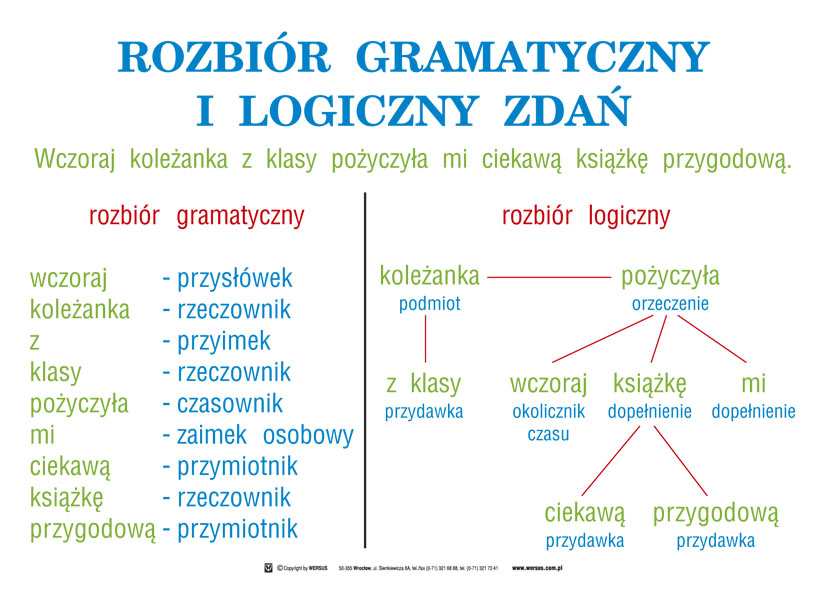

# Anazlia tekstu 

noun
adv
verb
pron
adj
space

Odmiana czasownika.
Formy czasownika.
Czasowniki dokonane i niedokonane.
Imiesłowy.
Rzeczownik.
Przypadki.
Przymiotnik.
Liczebnik.
Podział zaimków.
Przysłówek.
Przyimek, spójnik.
Partykuła, wykrzyknik.
Dziesięć części mowy.
Rozbiór gramatyczny i logiczny zdań.
Wielkie litery.
Kropka w skrótach i skrótowcach.
Pisownia zakończeń „ja” po spółgłoskach i samogłoskach.
Pisownia „rz”.
Pisownia „ż”.
Pisownia „sz”, „ż” po spółgłoskach.
Pisownia „ch”, „h”.
Pisownia „ó”.
Pisownia „u”.
Pisownia „nie” z różnymi częściami mowy – łącznie.
Pisownia „nie” z różnymi częściami mowy – rozdzielnie.
