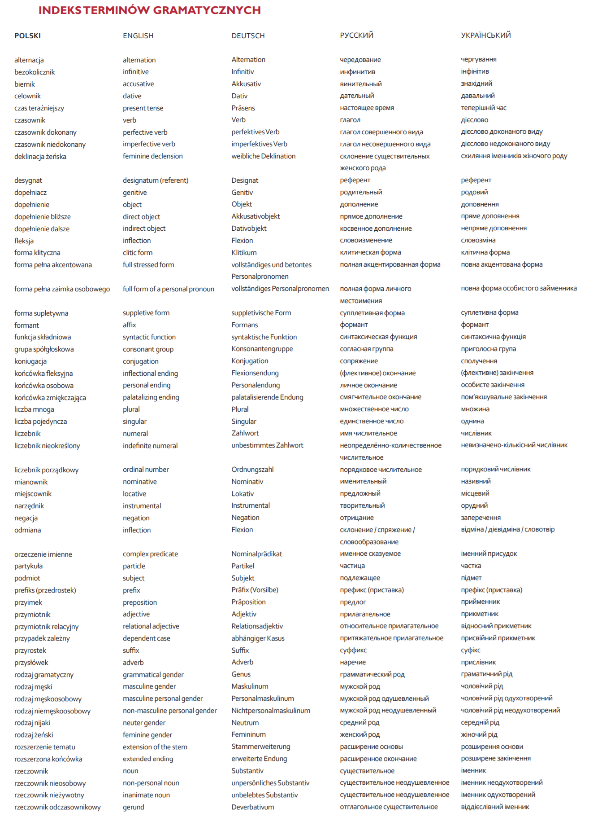
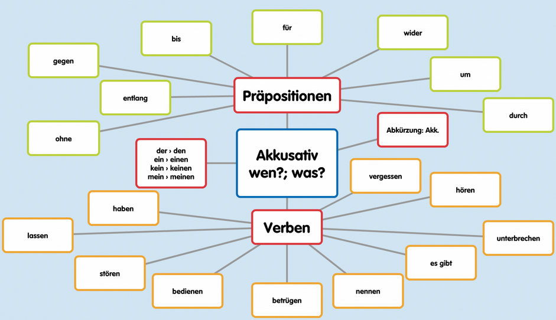
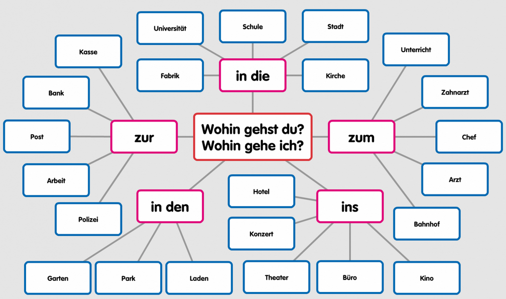
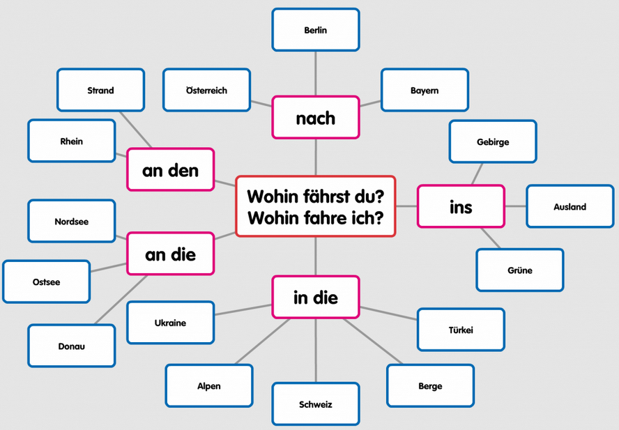
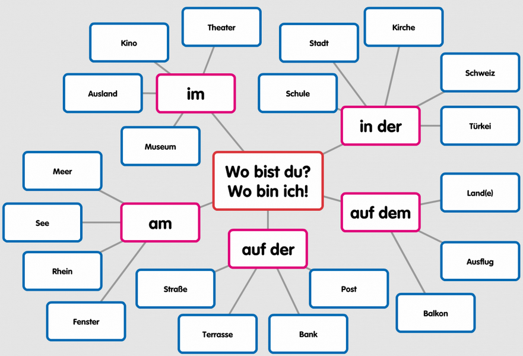
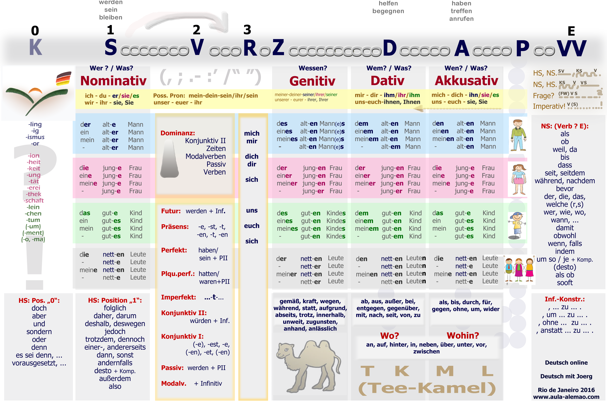
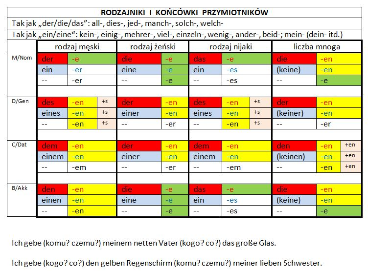

# docs
Documentation

### Implementation

[chat.md](CHAT.md)
[browser extension](BROWSER.md)

## indeks terminów 

## Rozwiązania

+ wyszukiwanie cytatów 
+ przykładowe frazy często występujące w życiu oraz ich analiza:
    + odmiana
    + przymiotniki
    + zaimki osobowe
    
    przykłady odmiany w innych osobach i przypadkach

## Analizator istniejącego zdania
pokazuje rozkłada zdania
określa części zdania
czas
przypadek
zdania podrzędne i nadrzędne

## Aplikacja do budowania zdań

trzeba zebrać słownictwo jakie ma być używane
Jakie czasy wykorzystywane i jakie typy zdań mają być budowane.

1. Zbuduj zdanie oznajmujące w czasie teraźniejszym

+ kombinacje tego dla zmiennych
+ 

+ Generator zadań

+ [ROZBIOR_GRAMATYCZNY.md](ROZBIOR_GRAMATYCZNY.md)
+ [ROZBIOR_LOGICZNY.md](ROZBIOR_LOGICZNY.md)

# Libraries

https://www.jqueryscript.net/form/Tagging-System-Autocomplete-Amsify-Suggestags.html

https://www.jqueryscript.net/demo/Simple-Animated-jQuery-Tags-Input-Plugin-Lovely-Tag/

### TOOLS

#### Spacy
https://spacy.io/models

#### pytorch
https://pytorch.org/tutorials/

#### Colaboratory
https://colab.research.google.com/notebooks/intro.ipynb#recent=true
Was ist Colaboratory?

Mit Colaboratory oder kurz "Colab" können Sie Python-Code in Ihrem Browser schreiben und ausführen. Sie können Folgendes tun:

    Keine Konfiguration erforderlich
    Kostenlosen Zugriff auf GPUs
    Einfache Freigabe

### Books

#### NLP

https://www.cl.cam.ac.uk/teaching/1314/L100/introling.pdf

#### Articles

https://blog.tyczkowski.com/2018/06/biernik-w-jezyku-niemieckim-akkusativ/

https://blog.tyczkowski.com/2017/04/okreslenia-miejsca-w-jezyku-niemieckim/

+ Wohin gehst du?
+ Wohin gehe ich?

+ Wohin fährst du?
+ Wohin fahre ich?

+ Wo bist du?
+ Wo bin ich?

https://www.helloangielski.pl/rozmowki/czasownik-byc/

## Chiński AI
http://gurulu.com/Default.aspx?Language=en-us&Do=1#

### Upraszczanie konstrukcji zdania poprzez analizę logiczną gramatyki
http://zasoby.open.agh.edu.pl/~11sustrojny/rozbior-gramatyczny/index.html

## Rozbiór logiczny zdania - analiza składniowa, etapy przeprowadzania
Rozbiór logiczny zdania to analiza zdania prowadząca do wyodrębnienia jego części – składników logicznych, czyli podmiotu, orzeczenia i ich określeń (przydawek, dopełnień i okoliczników). Umożliwia odróżnienie wyrazów nadrzędnych od podrzędnych, ustalenie ich funkcji w zdaniu oraz określenie zachodzących między nimi relacji składniowych.
https://eszkola.pl/jezyk-polski/rozbior-logiczny-zdania-9801.html

## Dyktowanie
https://dictation.io/speech

## Zasady niemieckiego
http://www.aula-alemao.com/rio/images/Satzbau17.png

https://agnieszkadrummer.wordpress.com/2012/05/19/dzien-19-majowe-wyzwanie/

https://podstawyniemieckiego.pl/przypadki-niemieckie/
https://www.nauka-niemieckiego.net/gramatyka/srednio-zaawansowanych/genitiv-niemiecki/

