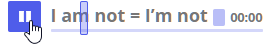

# docs
Documentation

### Implementation

[chat.md](CHAT.md)
[browser extension](BROWSER.md)

## indeks terminów 

# Rozwiązania

Celem rozwiązania goethe, jest wykorzystanie sztucznej inteligencji do analizy zdania
Program ma być użyty w roli nauczyciela, wskazującego błedy
oraz przykłady zawierające inne formy, by pokazać uczniowi:
 + jak poprawnie zbudować zdanie
 + gdzie i dlaczego był błąd z podaniem źródeł, tabel gramatycznych, itp 
 + Jak w innej formie z tym samym słownictwem zbudować zdania
 
Program w początkowej wersji będzie tylko wspierał podstawowe słownictwo, które jest często używane.
Ograniczenie zakresu gramatyki i słownictwa pozwoli na szybki start projektu.
Wraz z dojerzewaniem projektu, zakres będzie poszerzany.
Początkowy cel, na rok 2020 to nauka gramatyki z użyciem wielu form czasów w mowie i piśmie.

## Pierwsze wdrożenie
+ Program ma wspierać naukę gramatyki języka na poziomie A2-B1.
+ Pierwsza wersja nie będzie wspierała zaawansowanego słownictwa tematycznego a jedynie podstawy
+ Nie będzie też wspierane tłumaczenie trudnych form literackich, poezji, itp.

Te ograniczenia mają przyśpieszyć wdrożenie pierwszej użyteczniej wersji do praktycznej nauki.
Dopiero gdy zostanie zebrane doswiadczenie z praktycznej nauki, zostanie wprowadzona wersja kolejna
mająca pomóc w bardziej zaawansowanej nauce na poziomie B2 - C1.
Gdzie kluczową rolę gra profesjonalizacja języka, narracja, itp.

## Moduły wchodzące wskład programu goethe.pl
    
+ translator z języka polskiego, niemieckiego, angielskiego, rosyjskiego
+ analizator gramatyki języka do logicznego rozkładu zdań
+ interfejs graficzny i tekstowy, do pisania zdań i graficznej reprezentacji poszczególnych elementów
+ interfejs audio: transkrypcje zdań wypowiadanych oraz generowanie auio do zdań pisanych
+ słownik tekstowy: z tematycznym podziałem, synonimami
+ słownik graficzny: z obrazami przedstawiającymi sens wyrażeń, zdań, jako pomoc w nauce
+ quiz: budowanie zdań w ograniczonych zdefiniowanych przez nauczyciela ramach
+ analiza profilu ucznia: na podstawie analizy zdań z języka natywnego

## Analiza gotowych zdań

+ wyszukiwanie cytatów 
+ przykładowe frazy często występujące w życiu oraz ich analiza:
    + odmiana
    + przymiotniki
    + zaimki osobowe
    + inne formy
    + odmiany 
    + czasy
    przykłady odmiany w innych osobach i przypadkach

## Analizator tworzonego zdania przez ucznia

w ograniczonym zakresie, słownictwo podstawowe
    + pokazuje rozkłada zdania
    + określa części zdania
    + czas
    + przypadek
    + zdania podrzędne i nadrzędne

## Aplikacja do budowania zdań

### Tworzenie profilu ucznia
program na początku ma za zadanie określenie profilu ucznia,
by móc dostosować zakres słownictwa, tematykę  

#### Metoda 1:
Uczeń pisze przykładowe zdania po polsku, które chciałby umieć pisać w języku obcym

+ zdania te zostają zanalizowane po polsku
+ przetłumaczone na niemiecki przy uwzględnieniu form poziomu A2-B1 
    

### 
trzeba zebrać słownictwo jakie ma być używane
Jakie czasy wykorzystywane i jakie typy zdań mają być budowane.

1. Zbuduj zdanie oznajmujące w czasie teraźniejszym

+ kombinacje tego dla zmiennych
+ 

+ Generator zadań

+ [ROZBIOR_GRAMATYCZNY.md](ROZBIOR_GRAMATYCZNY.md)
+ [ROZBIOR_LOGICZNY.md](ROZBIOR_LOGICZNY.md)

# Libraries

https://www.jqueryscript.net/form/Tagging-System-Autocomplete-Amsify-Suggestags.html

https://www.jqueryscript.net/demo/Simple-Animated-jQuery-Tags-Input-Plugin-Lovely-Tag/

### TOOLS

#### Spacy
https://spacy.io/models

#### pytorch
https://pytorch.org/tutorials/

#### Colaboratory
https://colab.research.google.com/notebooks/intro.ipynb#recent=true
Was ist Colaboratory?

Mit Colaboratory oder kurz "Colab" können Sie Python-Code in Ihrem Browser schreiben und ausführen. Sie können Folgendes tun:

    Keine Konfiguration erforderlich
    Kostenlosen Zugriff auf GPUs
    Einfache Freigabe

### Books

#### NLP

https://www.cl.cam.ac.uk/teaching/1314/L100/introling.pdf

#### Articles

https://blog.tyczkowski.com/2018/06/biernik-w-jezyku-niemieckim-akkusativ/

https://blog.tyczkowski.com/2017/04/okreslenia-miejsca-w-jezyku-niemieckim/

+ Wohin gehst du?
+ Wohin gehe ich?

+ Wohin fährst du?
+ Wohin fahre ich?

+ Wo bist du?
+ Wo bin ich?

https://www.helloangielski.pl/rozmowki/czasownik-byc/

## Chiński AI
http://gurulu.com/Default.aspx?Language=en-us&Do=1#

### Upraszczanie konstrukcji zdania poprzez analizę logiczną gramatyki
http://zasoby.open.agh.edu.pl/~11sustrojny/rozbior-gramatyczny/index.html

## Rozbiór logiczny zdania - analiza składniowa, etapy przeprowadzania
Rozbiór logiczny zdania to analiza zdania prowadząca do wyodrębnienia jego części – składników logicznych, czyli podmiotu, orzeczenia i ich określeń (przydawek, dopełnień i okoliczników). Umożliwia odróżnienie wyrazów nadrzędnych od podrzędnych, ustalenie ich funkcji w zdaniu oraz określenie zachodzących między nimi relacji składniowych.
https://eszkola.pl/jezyk-polski/rozbior-logiczny-zdania-9801.html

## Dyktowanie
https://dictation.io/speech

## Zasady niemieckiego
http://www.aula-alemao.com/rio/images/Satzbau17.png

https://agnieszkadrummer.wordpress.com/2012/05/19/dzien-19-majowe-wyzwanie/

https://podstawyniemieckiego.pl/przypadki-niemieckie/
https://www.nauka-niemieckiego.net/gramatyka/srednio-zaawansowanych/genitiv-niemiecki/

