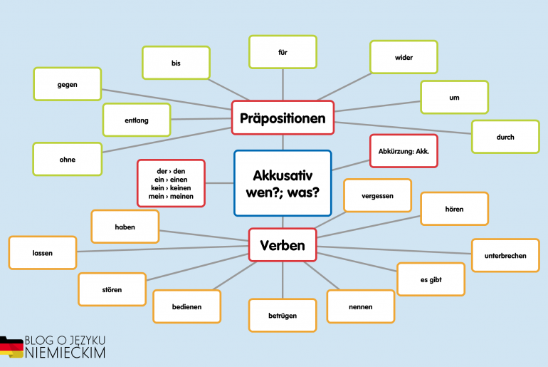

# rozbior gramatczyny 

https://blog.tyczkowski.com/2018/06/biernik-w-jezyku-niemieckim-akkusativ/

# goethe
Aplikacja oparta o język python umożliwiająca analizę gramatyczną języka niemieckiego

Zdanie (Część zdania)
Czas:
  + przeszły
  + teraźniejszy  
  + przyszły
  

Typ
 + zdanie pytające
 + zdanie rozkazujące
 + zdanie oznajmujące Aussagesatz m 
  
  
# Przykłady generowanedla wszystkich kombinacji

Pytające:
Gdzie idziesz?
Kiedy wrócisz?
Co robisz?

Oznajmujące:
Idę do szkoły.
Za pół godziny wrócę.
Piszę kartkówkę.

Rozkazujące:
Wracaj!
Posprzątaj pokój!
Umyj naczynia! 

# Tagi 
używanie w konstrukcjach zdania tagów

Jaki typ zdania 

[Dzień 19 – majowe wyzwanie | Agnieszka Drummer - język niemiecki](https://agnieszkadrummer.wordpress.com/2012/05/19/dzien-19-majowe-wyzwanie/)

## Modele

na bazie analizy logicznej gramatyki zdań można stworzyć kilka wairantów aplikacji:

### Tester Gramatyki
Podaje wszystkie informacje o zdaniu i jego częściach

Analiza skupia się na:
+ czasie:
+ częsciach zdania: nadrzędne, podrzędne
+ typach zdań: oznajmujące, pytające, 
+ wyrazach, rodzajnikach, formach
+ Zaimkach, przyimkach

###  Quiz

Najpierw trzeba zaznaczyć czego chcemy się uczyć
Generator tworzy określoną ilość konstrukcji.
Quiz polega na wyborze, która konstrukcja jest poprawna wedlug okreslonego wzoru.

### Generator wzorów zdan

polega na tworzeniu wedle wzoru:

czas zdania nadrzednego, podrzednego
W jakiej osobie, do kogo
Czy ma uzywac okreslonych słów czy grup, czy  mix

# lasttermin
totu.app/web/
totu.app/blog
