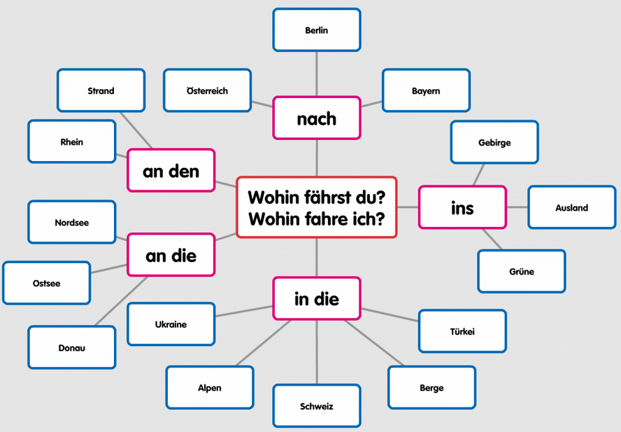
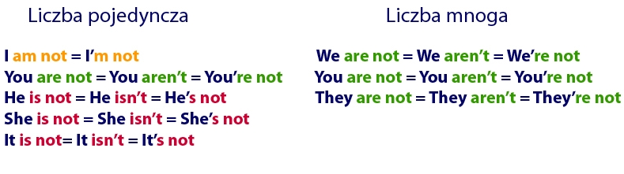

# Teoria

https://blog.tyczkowski.com/2018/06/biernik-w-jezyku-niemieckim-akkusativ/

https://blog.tyczkowski.com/2017/04/okreslenia-miejsca-w-jezyku-niemieckim/

+ Wohin gehst du?
+ Wohin gehe ich?

+ Wohin fährst du?
+ Wohin fahre ich?

+ Wo bist du?
+ Wo bin ich?

https://www.helloangielski.pl/rozmowki/czasownik-byc/

## Chiński AI
http://gurulu.com/Default.aspx?Language=en-us&Do=1#

### Upraszczanie konstrukcji zdania poprzez analizę logiczną gramatyki
http://zasoby.open.agh.edu.pl/~11sustrojny/rozbior-gramatyczny/index.html

## Rozbiór logiczny zdania - analiza składniowa, etapy przeprowadzania
Rozbiór logiczny zdania to analiza zdania prowadząca do wyodrębnienia jego części – składników logicznych, czyli podmiotu, orzeczenia i ich określeń (przydawek, dopełnień i okoliczników). Umożliwia odróżnienie wyrazów nadrzędnych od podrzędnych, ustalenie ich funkcji w zdaniu oraz określenie zachodzących między nimi relacji składniowych.
https://eszkola.pl/jezyk-polski/rozbior-logiczny-zdania-9801.html

## Dyktowanie
https://dictation.io/speech

## Zasady niemieckiego
http://www.aula-alemao.com/rio/images/Satzbau17.png

https://agnieszkadrummer.wordpress.com/2012/05/19/dzien-19-majowe-wyzwanie/

https://podstawyniemieckiego.pl/przypadki-niemieckie/
https://www.nauka-niemieckiego.net/gramatyka/srednio-zaawansowanych/genitiv-niemiecki/

## indeks terminów 

